# Sistem Absensi dengan QR Code dan Face Recognition

Aplikasi mobile berbasis Flutter untuk manajemen absensi kampus dengan verifikasi QR Code dan Face Recognition.

## 📱 Tech Stack

### Frontend
- **Framework**: Flutter 3.x
- **State Management**: Riverpod
- **Camera**: camera package
- **QR Code**: qr_flutter, mobile_scanner
- **HTTP Client**: dio

### Backend
- **Framework**: Python Flask
- **Database**: MySQL/MariaDB
- **Face Recognition**: face_recognition library
- **Authentication**: JWT
- **Image Processing**: PIL, OpenCV

---

## 👥 User Roles

### 1. Admin
- Mengelola data dosen, mahasiswa, mata kuliah, dan kelas
- Mengatur jadwal kelas dan assignment dosen
- Full CRUD operations untuk semua entitas

### 2. Dosen
- Membuka dan menutup sesi absensi
- Memverifikasi wajah saat membuka sesi
- Melihat daftar kehadiran mahasiswa
- Mengelola pertemuan kelas

### 3. Mahasiswa
- Scan QR code untuk absensi
- Verifikasi wajah saat absensi
- Melihat daftar pertemuan dan status kehadiran
- Registrasi wajah untuk verifikasi

---

## 🎯 Use Case Diagram

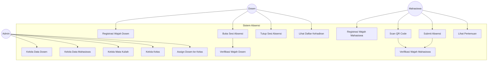

---

## 📊 Alur Kerja Aplikasi (Application Workflow)

### Overview Sistem

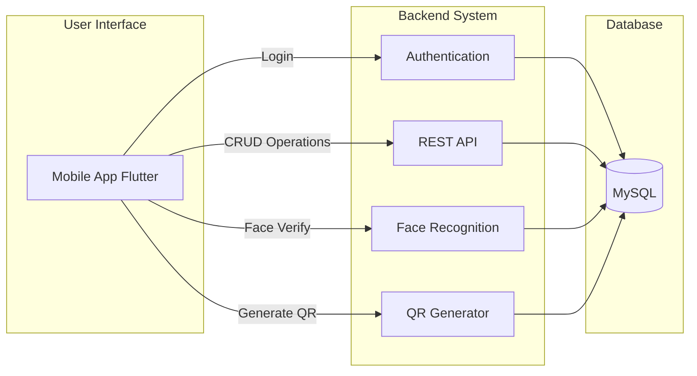

### Alur Kerja Admin

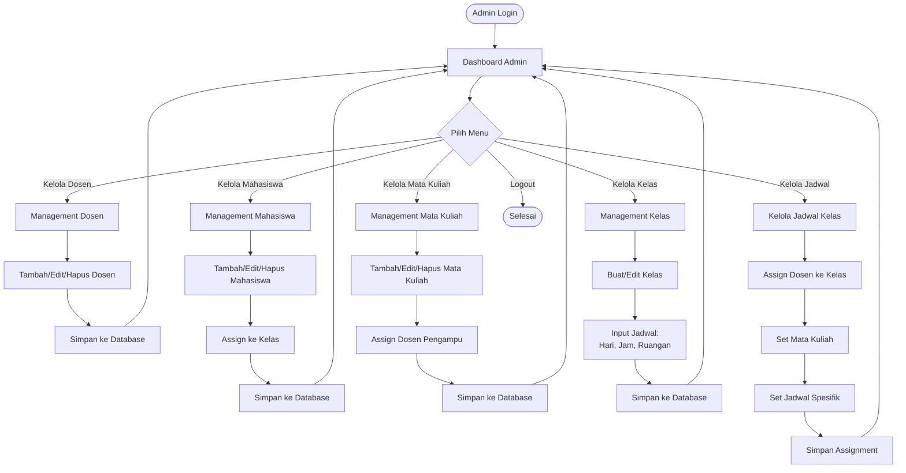

### Alur Kerja Dosen Lengkap

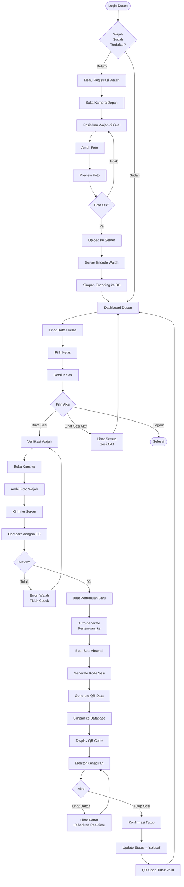

### Alur Kerja Mahasiswa Lengkap

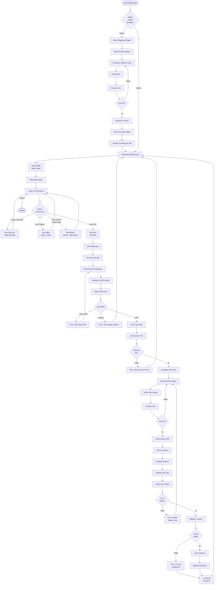

### Alur Data Flow

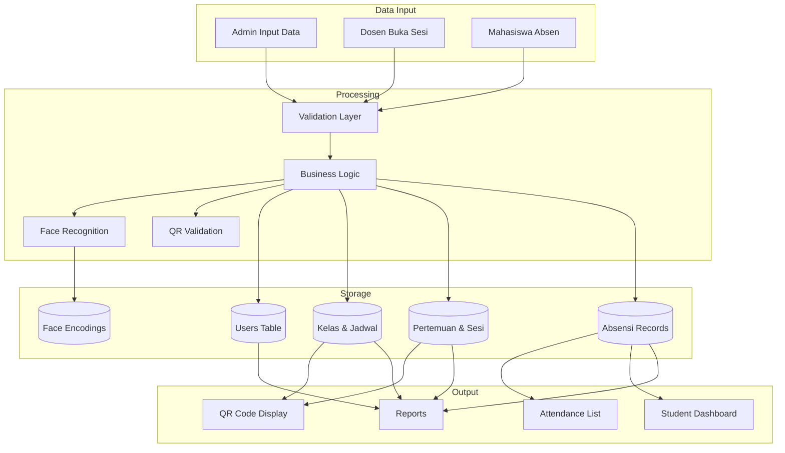

### State Diagram - Sesi Absensi

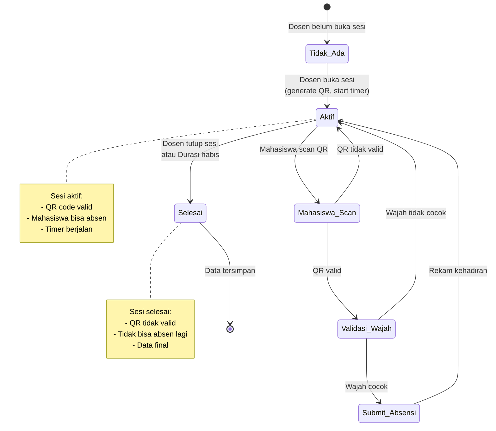

---

## 🔄 Activity Diagram

### Flow Absensi Mahasiswa

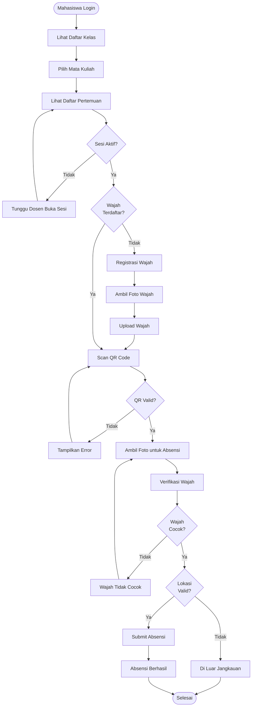

### Flow Buka Sesi Dosen

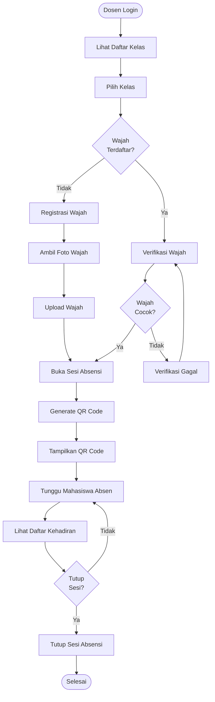

---

## 🏗️ System Architecture

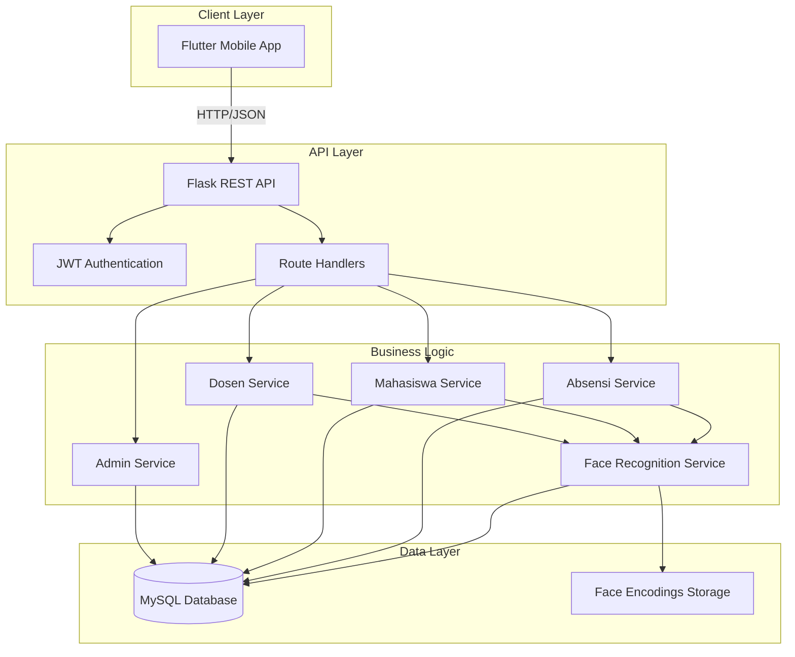

---

## 💾 Database Schema

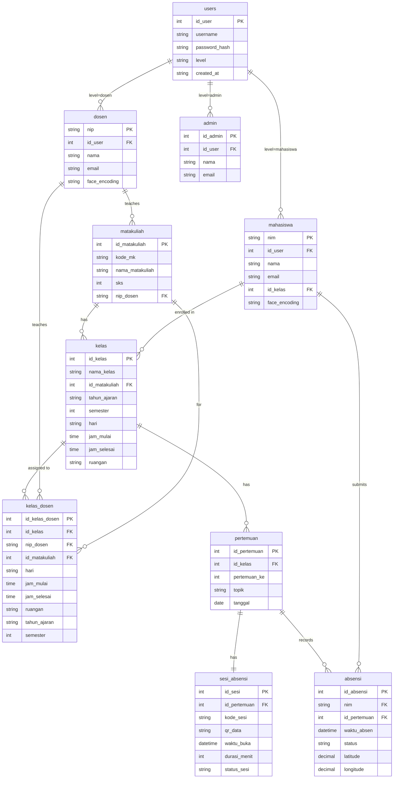

---

## 🔐 Authentication Flow

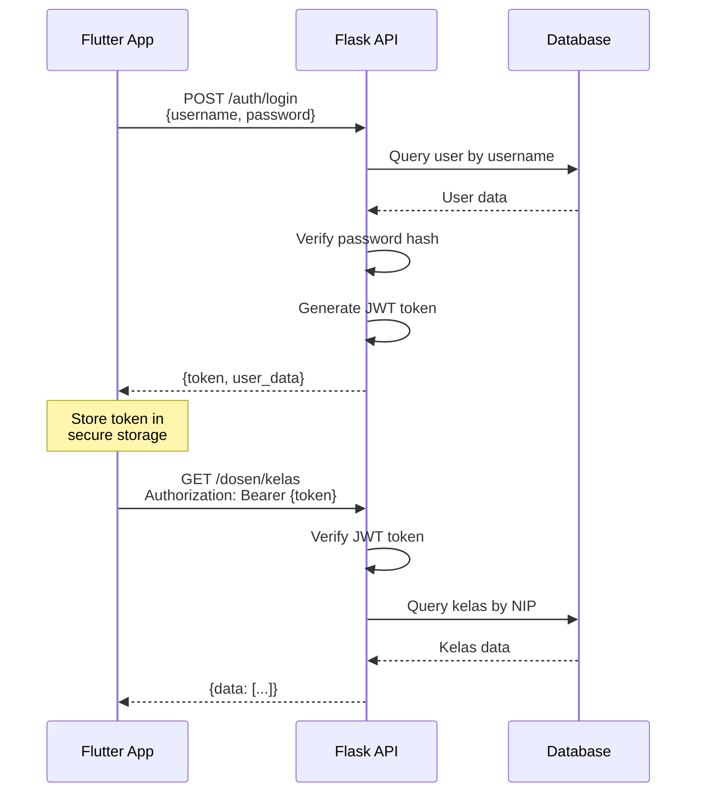

---

## 📸 Face Recognition Flow

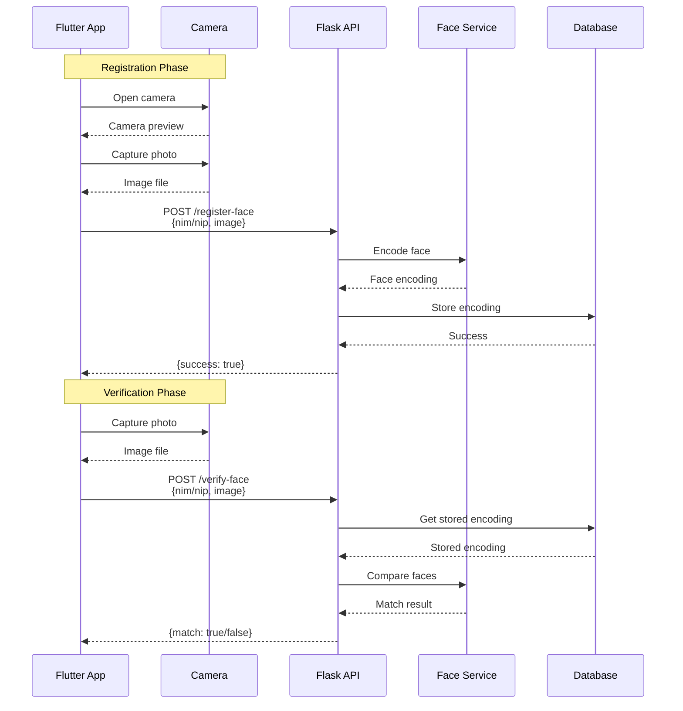

---

## 🎫 QR Code Absensi Flow

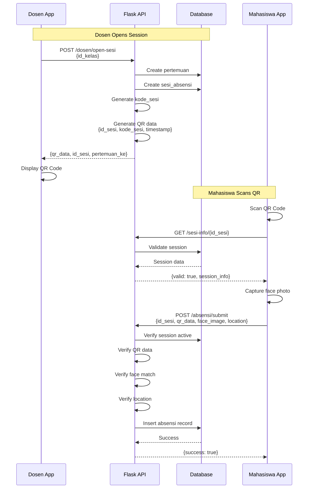

---

## 📁 Project Structure

```
Absensi-main/
├── backend/
│   └── server/
│       ├── app.py                 # Main Flask application
│       ├── database/
│       │   └── db.py             # Database connection
│       ├── routes/
│       │   ├── auth_routes.py    # Authentication endpoints
│       │   ├── admin_routes.py   # Admin CRUD endpoints
│       │   ├── dosen_routes.py   # Dosen endpoints
│       │   ├── mahasiswa_routes.py
│       │   └── absensi_routes.py
│       ├── services/
│       │   ├── admin_service.py
│       │   ├── dosen_service.py
│       │   ├── mahasiswa_service.py
│       │   ├── absensi_service.py
│       │   └── face_service.py   # Face recognition logic
│       └── utils/
│           └── jwt_auth.py       # JWT utilities
│
├── lib/
│   ├── main.dart                 # App entry point
│   ├── config/
│   │   ├── app_colors.dart
│   │   ├── constants.dart
│   │   └── theme.dart
│   ├── models/
│   │   ├── kelas_model.dart
│   │   ├── sesi_model.dart
│   │   └── user_model.dart
│   ├── providers/
│   │   ├── auth_provider.dart    # Riverpod state
│   │   ├── dosen_provider.dart
│   │   └── mahasiswa_provider.dart
│   ├── services/
│   │   ├── auth_service.dart     # API calls
│   │   ├── admin_service.dart
│   │   ├── dosen_service.dart
│   │   └── mahasiswa_service.dart
│   ├── screens/
│   │   ├── auth/
│   │   │   ├── login_screen.dart
│   │   │   └── splash_screen.dart
│   │   ├── admin/
│   │   │   ├── admin_dashboard.dart
│   │   │   ├── dosen_management_screen.dart
│   │   │   ├── mahasiswa_management_screen.dart
│   │   │   ├── matakuliah_management_screen.dart
│   │   │   ├── kelas_management_screen.dart
│   │   │   └── kelas_assignment_screen.dart
│   │   ├── dosen/
│   │   │   ├── dosen_dashboard.dart
│   │   │   ├── kelas_detail_screen.dart
│   │   │   ├── open_sesi_screen.dart
│   │   │   ├── active_sessions_screen.dart
│   │   │   ├── pertemuan_detail_screen.dart
│   │   │   ├── dosen_face_registration_screen.dart
│   │   │   └── dosen_face_verify_screen.dart
│   │   └── mahasiswa/
│   │       ├── mahasiswa_dashboard.dart
│   │       ├── mahasiswa_pertemuan_list_screen.dart
│   │       ├── scan_qr_absensi_screen.dart
│   │       ├── absensi_screen.dart
│   │       └── face_registration_screen.dart
│   └── widgets/
│       └── gradient_background.dart
│
└── database/
    └── absensi_pnl.sql           # Database schema
```

---

## 🚀 Installation & Setup

### Backend Setup

1. **Install Python dependencies:**
```bash
cd backend/server
pip install flask flask-cors pymysql face_recognition pillow pyjwt python-dotenv
```

2. **Configure database:**
```bash
# Import database schema
mysql -u root -p < database/absensi_pnl.sql
```

3. **Update config:**
```python
# backend/server/database/db.py
DB_CONFIG = {
    'host': 'localhost',
    'user': 'root',
    'password': 'your_password',
    'database': 'absensi_pnl'
}
```

4. **Run server:**
```bash
python app.py
# Server runs on http://0.0.0.0:5000
```

### Frontend Setup

1. **Install Flutter dependencies:**
```bash
flutter pub get
```

2. **Update API endpoint:**
```dart
// lib/config/constants.dart
static const String baseUrl = 'http://YOUR_IP:5000';
```

3. **Run app:**
```bash
flutter run
```

---

## 🔑 Default Login Credentials

| Role | Username | Password |
|------|----------|----------|
| Admin | admin | admin123 |
| Dosen | 202357301001 | dosen123 |
| Mahasiswa | 2023573010085 | mahasiswa123 |

---

## ✨ Key Features

### Admin Features
- ✅ CRUD Dosen, Mahasiswa, Mata Kuliah, Kelas
- ✅ Assign dosen ke kelas dengan jadwal spesifik
- ✅ Manajemen multi-assignment (dosen bisa mengajar kelas yang sama di waktu berbeda)

### Dosen Features
- ✅ Face registration & verification sebelum buka sesi
- ✅ Generate QR code untuk sesi absensi
- ✅ Auto-generate pertemuan_ke
- ✅ Monitor kehadiran real-time
- ✅ Lihat daftar kehadiran per pertemuan
- ✅ Tutup sesi absensi

### Mahasiswa Features
- ✅ Face registration untuk verifikasi
- ✅ Scan QR code untuk absensi
- ✅ Face verification saat submit absensi
- ✅ Location verification
- ✅ Lihat daftar 16 pertemuan per mata kuliah
- ✅ Status kehadiran per pertemuan (Hadir/Tidak Hadir/Belum Ada Sesi)

---

## 🎨 UI/UX Features

- ✅ Gradient background consistency across all screens
- ✅ Modern AppBar with proper theming
- ✅ Full-screen camera preview (no black areas)
- ✅ Responsive time pickers for schedule input
- ✅ Card-based layouts with shadows
- ✅ Smooth animations and transitions
- ✅ Color-coded status indicators

---

## 🔒 Security Features

- JWT-based authentication
- Password hashing (bcrypt recommended)
- Face encoding storage (not raw images)
- QR code with timestamp validation
- Session expiration (durasi_menit)
- Location-based verification
- API route protection with decorators

---

## 📊 Business Rules

1. **Pertemuan**: Auto-generated 1-16 per kelas
2. **Sesi Absensi**: Hanya bisa dibuka oleh dosen yang ter-assign
3. **Face Verification**: Required untuk dosen (buka sesi) dan mahasiswa (absensi)
4. **QR Code**: Valid hanya untuk sesi yang aktif
5. **Location**: Mahasiswa harus dalam radius tertentu
6. **Status Sesi**: `aktif` (bisa absen) atau `selesai` (tidak bisa absen)

---

## 🐛 Known Issues & Solutions

### Issue: Session not found
**Solution**: Restart backend, ensure data integrity in `sesi_absensi` table

### Issue: Face not recognized
**Solution**: Re-register face with better lighting and clear frontal photo

### Issue: QR scan timeout
**Solution**: Ensure sesi is still active (check durasi_menit)

---

## 📝 Development Notes

### Recent Updates
- ✅ Fixed schedule display using `kelas_dosen` table
- ✅ Added schedule fields to kelas management form
- ✅ Fixed UI backgrounds to full screen
- ✅ Fixed camera preview aspect ratio
- ✅ Removed unused Riwayat & Statistik features
- ✅ Consistent gradient theming across all screens

### Future Enhancements
- [ ] Push notifications for new sesi
- [ ] Export attendance to Excel
- [ ] Analytics dashboard untuk admin
- [ ] Multi-language support
- [ ] Dark mode toggle

---

## 📞 Support

For issues or questions, contact the development team or create an issue in the repository.

---

## 📄 License

This project is for educational purposes. All rights reserved.

---

**Made with ❤️ for PNL Campus**
